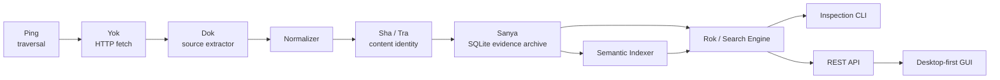

# Architecture

Ping is a local-first pipeline. Sanya is the durable boundary; all other
components either create observations or derive read-only views from them.

## Current subsystems

| Subsystem | Responsibility | Boundary |
| --- | --- | --- |
| Ping | Traverse a plugin's permitted links and discover work. | Does not coordinate HTTP or persistence policy. |
| Yok | Fetch one URL politely, with retries and timing. | Returns raw response evidence. |
| Dok | Convert source-specific HTML into `JobRecord` values and discover links. | Source-specific code belongs here. |
| Sha / Tra | Normalize and create deterministic SHA-256 identities. | Content identity only; no persistence. |
| Sanya | Own SQLite schema, crawl state, job identity, and immutable revisions. | The durable system of record. |
| Rok | Query current job records. | Read-only; currently keyword matching. |
| Inspection service | Shared read-only use cases for CLI, API, and GUI. | No presentation or transport decisions. |

## Future subsystems

| Subsystem | Responsibility | Rule |
| --- | --- | --- |
| Semantic Indexer | Build local derived indexes from revisions. | Rebuildable; never canonical. |
| Search Engine | Combine FTS, vector similarity, filters, and later reranking. | Returns scores and evidence IDs. |
| REST API | Versioned transport over read/write application services. | No SQL in route handlers. |
| GUI | Desktop-first operational view. | Uses the same API contract as the CLI. |
| Scheduler | Starts configured crawls and records scheduled intent/outcomes. | Does not bypass crawler safeguards. |
| Plugin system | Supplies source-specific crawl policy and extractor. | New sources require no core edits. |
| Configuration | Validated local settings for database, plugins, schedules, and logging. | Configuration is explicit and inspectable. |

## Ownership rules

The application layer coordinates a crawl: it asks Ping for work, Yok to fetch,
Dok to parse, Sha to identify content, and Sanya to preserve it. Ping itself
only discovers traversal work. Search, API, and GUI consume read services;
they do not read SQLite independently or duplicate business rules.

## Plugin contract

`ping.plugins.SourcePlugin` is the Phase 2 contract. A plugin declares its
source identity, seed URLs, allowed domains, extractor, robots policy, and
rate settings. The existing `configured_sources()` function remains an
adapter until entry-point discovery is added. Plugin loading is intentionally
deferred until two independently maintained source plugins prove the need.

## Search architecture

Keyword search is SQLite FTS5 over a normalized text projection of each job
revision. Semantic search is a derived vector index keyed by revision ID,
embedding model name, dimensions, and content hash. Hybrid search normalizes
FTS and vector scores then combines them with explicit weights. The indexer
only processes a revision when its content hash lacks a completed embedding
for the selected model; changing a model creates a new index generation rather
than mutating historical vectors.

See [ROADMAP.md](ROADMAP.md) for implementation order and
[DATA_MODEL.md](DATA_MODEL.md) for the durable and derived tables.
