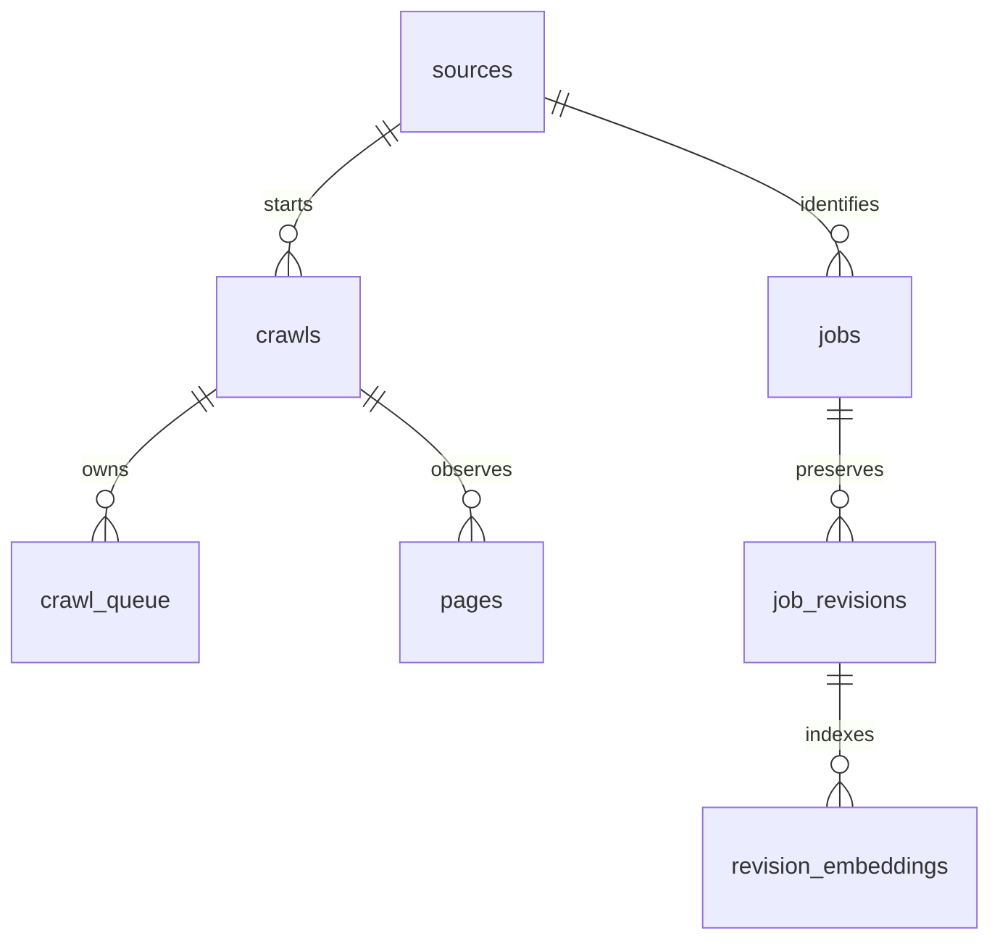

# Data Model

Sanya owns the SQLite schema. The first six tables exist today; search tables
are Phase 2 migrations and are derived data that can be rebuilt.

## Current tables

| Table | Why it exists | Key relationships |
| --- | --- | --- |
| `sources` | Stores configured source identity and crawl settings once observed. | One source has many crawls and jobs. |
| `crawls` | Records one crawl attempt, outcome, and summary counters. | Belongs to `sources`; owns pages and queue entries. |
| `crawl_queue` | Makes traversal resumable and explains queue status/errors. | Belongs to `crawls`; unique `(crawl_id, url)`. |
| `pages` | Preserves fetch observations and raw HTML identity. | Belongs to `crawls`; unique `(crawl_id, url)`. |
| `jobs` | Holds stable source identity and lifecycle timestamps. | Belongs to `sources`; has many revisions. |
| `job_revisions` | Stores immutable normalized job evidence. | Belongs to `jobs`; unique `(job_id, content_hash)`. |

`jobs` is deliberately sparse. Mutable job fields live in `job_revisions` so a
current view is the newest revision and historical views remain intact.

## Planned derived tables

| Table | Purpose | Lifecycle |
| --- | --- | --- |
| `revision_search_documents` | FTS5 projection of normalized revision text. | Rebuild from `job_revisions`. |
| `embedding_models` | Names a local model, dimension, version, and normalization policy. | Append a row for each model generation. |
| `revision_embeddings` | Associates a revision/content hash with an embedding model and vector blob. | Insert-only for a model/hash; stale when source hash or model changes. |
| `index_runs` | Explains indexing backlog, success, failure, and timing. | Operational evidence. |
| `saved_searches` | Stores user-owned query/filter definitions for GUI/API. | Mutable user preference, not source evidence. |

`revision_embeddings` must contain `revision_id`, `content_hash`, `model_id`,
`dimensions`, `vector`, `created_at`, and optional error/status fields. The
vector encoding is an implementation choice, initially a validated little-
endian float32 BLOB. Do not make embeddings canonical: source text and
revision hashes remain authoritative.

## Revision and index rules

1. A new content hash creates a new `job_revisions` row.
2. The indexer creates FTS and embedding work for that row.
3. An unchanged observation only advances `jobs.last_seen`; it does not create
   or refresh an embedding.
4. A model upgrade creates a new `embedding_models` row and a backfill; prior
   vectors remain available until retirement is explicitly recorded.
5. Failed indexing is recorded and retryable. It never blocks Sanya's commit.
