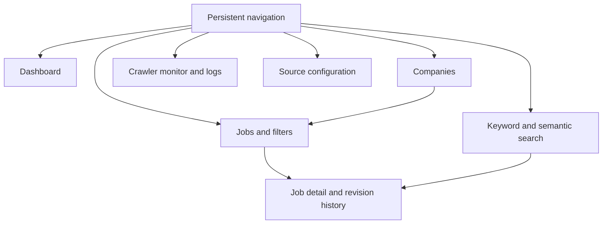

# Desktop-first GUI Design

The GUI is an operational archive browser, not a marketing site. It is built
after the API adapter and consumes `/api/v1`; it does not open SQLite or repeat
archive/search logic. The recommended implementation is FastAPI with server
rendered HTMX views and a small amount of JavaScript. This keeps deployment
local and avoids a React build chain until rich client interaction is proven
necessary. Tailwind is acceptable but optional.

## Information layout

## Screens

| Screen | Primary content | Essential actions |
| --- | --- | --- |
| Dashboard | Recent crawl outcomes, archive counts, index freshness, failures. | Open failed crawl, recent job, or search. |
| Recent jobs | Filterable current job list. | Filter, save search, open evidence. |
| Companies | Latest-revision company aggregation. | Open jobs and search by company. |
| Search | Keyword/semantic/hybrid mode, filters, ranked results, score explanation. | Save, rerun, inspect evidence. |
| Job detail | Current normalized fields, source URL, first/last seen. | Compare revisions and open source evidence. |
| Revision history | Chronological immutable revisions and field differences. | Inspect content hash and index state. |
| Crawler monitor | Running/recent crawls, queue, pages, failures, timings. | Open crawl evidence; start/resume only with explicit source choice. |
| Logs | Filtered structured log stream with correlation/crawl ID. | Copy and filter an event. |
| Sources | Plugin metadata, rate policy, robots policy, enabled state. | Validate configuration; enable/disable after Phase 3. |
| Saved searches | Named queries and filters. | Run, rename, delete. |

## Interaction rules

- Tables are dense, sortable, and retain filters in the URL.
- Every derived result links to its job and revision evidence.
- Search shows `keyword_score`, `semantic_score`, and final score when present.
- Empty states explain whether the archive lacks data, filters exclude it, or an
  index is pending.
- Mutations require an explicit confirmation and expose resulting crawl or
  index-run IDs.
- Accessibility baseline: keyboard navigation, visible focus, sufficient
  contrast, text labels for controls, and no information conveyed only by color.

## Delivery order

1. Read-only dashboard, jobs, job detail, revisions, companies, and crawler
   history using the existing inspection service.
2. Keyword search and saved searches.
3. Semantic/hybrid search and index freshness views.
4. Controlled source and scheduler operations.
